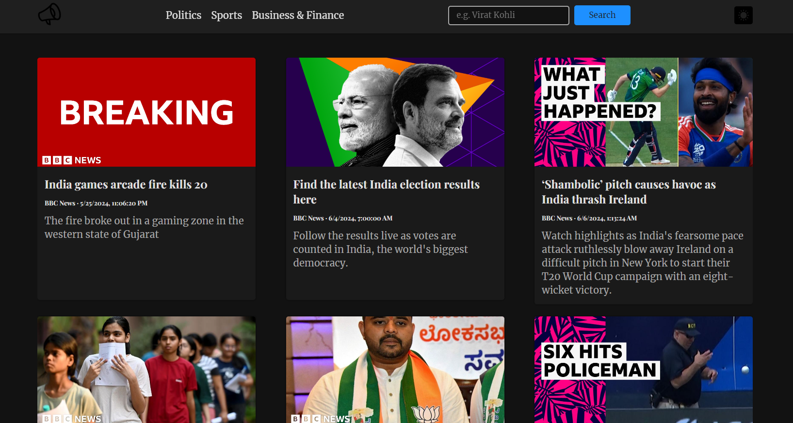
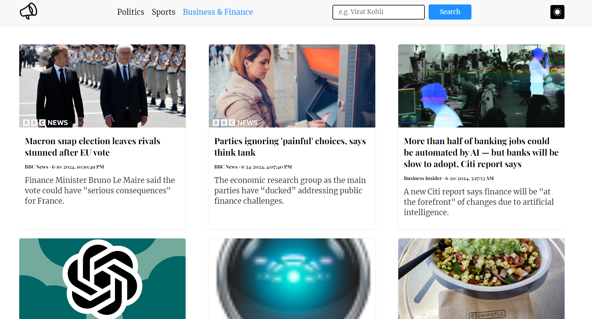

# Quick NEWS



Welcome to NewsPortal, a dynamic news website powered by the [NewsAPI](https://newsapi.org/) service. Stay updated with the latest news from around the world with real-time recommendations, categorized news panels, and seamless search functionality. Switch between dark and light modes for a personalized reading experience.


## Features:

- **Real-time News Recommendations**: Get personalized news recommendations based on your interests.
- **Categorized News Panels**: Explore separate panels for sports, political, and financial news.
- **Search Functionality**: Easily search for news articles by keywords or topics.
- **Dark/Light Mode Switch**: Toggle between dark and light modes for comfortable reading.


## Tech Stacks:

- **HTML**: Structure and content markup.
- **CSS**: Styling and layout design.
- **JavaScript**: Frontend logic and interaction with the NewsAPI.
- **NewsAPI**: External API for fetching news articles.


## App In Action:


- **Category Based/Change Theme**



- **Search on a particular topic**


## Setup: 

1. Clone the repository:

   ```bash
   git clone https://github.com/yourusername/news-portal.git

2. Navigate into the project directory:

   ```bash
   cd news-portal

3. Obtain your API key from NewsAPI and replace YOUR_API_KEY in the scripts.js file with your actual API key.

const apiKey = 'YOUR_API_KEY';
const apiUrl = ' Replace with your NewsAPI URL'; 

4. Open index.html in your web browser to view the news portal or run Go Live command on VS code.